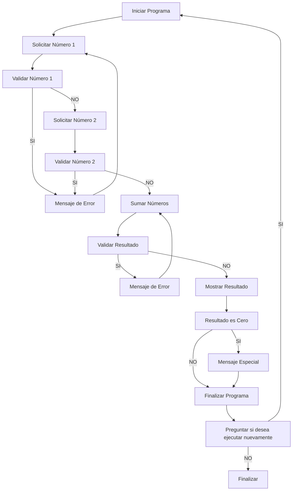

# 📊 Diagrama de Flujo

```mermaid
graph TD
    A[Iniciar Programa] --> B[Solicitar Número 1]
    B --> C[Validar Número 1]
    C -->|SI| D[Mensaje de Error]
    C -->|NO| E[Solicitar Número 2]
    D --> B
    E --> F[Validar Número 2]
    F -->|SI| D
    F -->|NO| G[Sumar Números]
    G --> H[Validar Resultado]
    H -->|SI| I[Mensaje de Error]
    H -->|NO| J[Mostrar Resultado]
    I --> G
    J --> K[Resultado es Cero]
    K -->|SI| L[Mensaje Especial]
    K -->|NO| M[Finalizar Programa]
    L --> M
    M --> N[Preguntar si desea ejecutar nuevamente]
    N -->|SI| A
    N -->|NO| O[Finalizar]
```